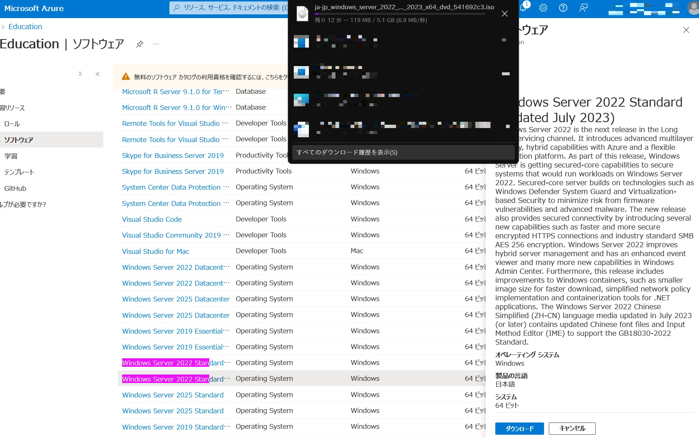

Mictosoftは学生の学習向けに様々なMicrosoftのソフトを無償で提供しています。  
そこで今回はWindows Server 2022でActive Directoryを構築していきます。  

### ダウンロード
Microsoftのポータルサイトに大学から配布されたMiscrosoftアカウントでログインして`Education→ソフトウェア`の順にアクセスします。  
[https://portal.azure.com/#view/Microsoft_Azure_Education/EducationMenuBlade/~/software](https://portal.azure.com/#view/Microsoft_Azure_Education/EducationMenuBlade/~/software)  
執筆現在はWindows Server 2025まで利用でいます。  

ライセンスキーはダウンロードを開始するとダウンロードのボタンの下をスクロールすると`キーを表示する`というボタンが現れます。