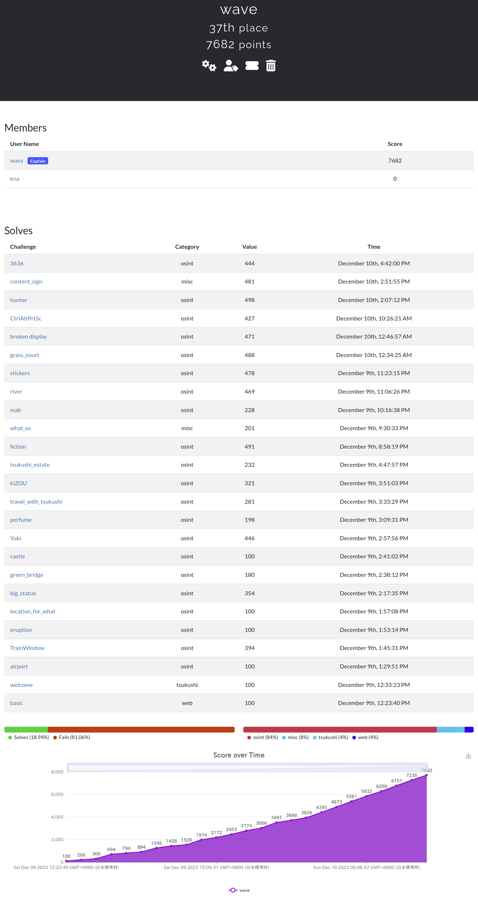
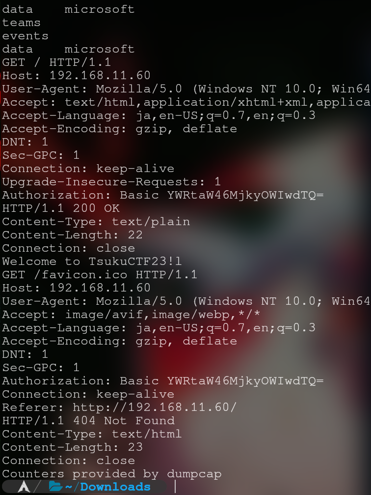
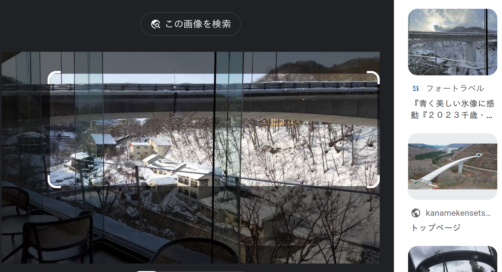
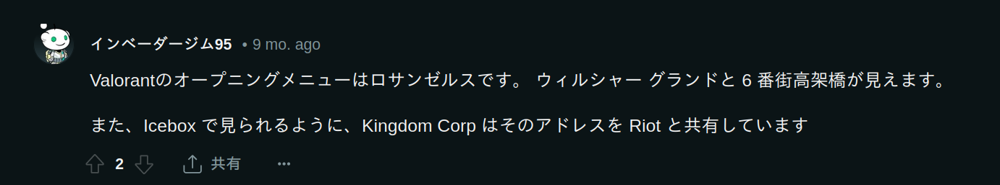
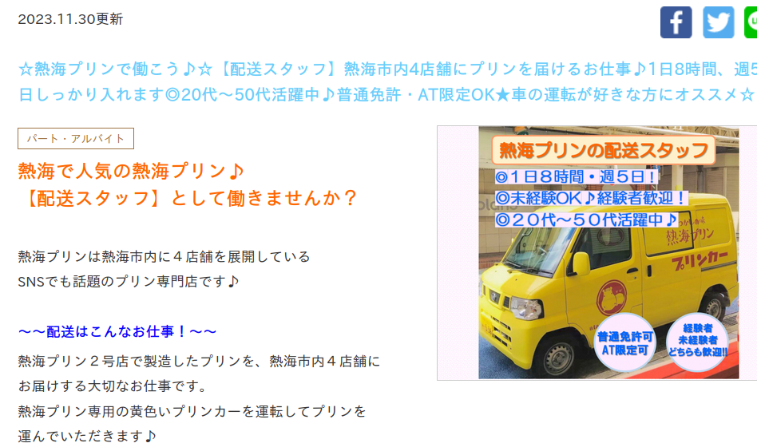
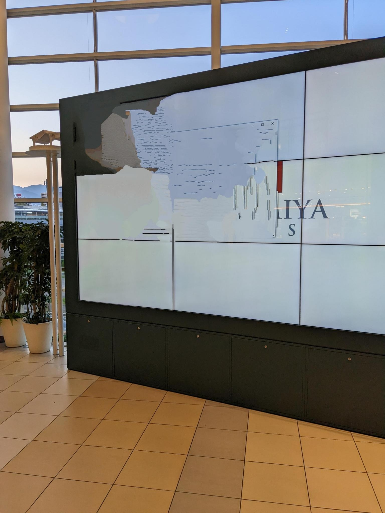
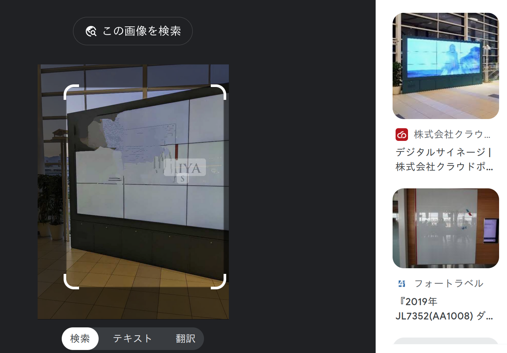

## 結果


昨年参加したことを友達に話すと興味を持ってくれて、今年は一緒にやろうと当日に誘って来てくれたのですが、1時間くらいで友達は諦めモードに入ってしまい
結局去年と同じほぼ一人で参加していました。(急に誘った私が悪い)  

## basic 
pcapngファイルが渡されます。Wiresharkを開くと確実ですが、以前pcapngをstringsで読んでる人を見て今回それを真似をしました。
```bash
$strings basic.pcapng
```
トラフィック量が多いと大変でしたが少なかったので良かったです。

最後が'='で終わっている明らかにBase64っぽい箇所をコピペして[Cyberchef](https://gchq.github.io/CyberChef/)で複合しました。

## airport 
プロペラが特徴的だなと思いながらGoogleレンズにそのまま投げるとBlogが出てきます。

## TrainWindow 
島が見える見えるなと思いながらでアパートにフォーカスしながらGoogleレンズで検索しました。熱海市の賃貸物件の記事ができて、確認するとその場所だとわかります。TrainWindowというタイトルから線路の上がFlagです。

## eruption 
Googleレンズ投げると桜島だとことが分かります。けどExif情報を見ると時間が書かれています。

## location_for_what 
映画も見たことあるし、新宿御苑に行ったこともあったので即答だったのですが、Googleレンズに投げて場所がわかってから"ロケ地"とか入力すると出てきます。

## big_statue
最初は台湾か中国かなと思っていましたが、中国も台湾も左ハンドルだそうです。  
Googleレンズで書いてある文字"榴莲王 利陞"を検索するとそれっぽいFacebookがでてきます。しばらく投稿されている画像を眺めていると
背景と一致するような箇所がいくつか見られます。住所を確認すろとシンガポールだと分かります。

## green_bridge 
Googleレンズでそのまま検索すると同じ位置で撮影されたと思われるBlogが出てきます。

## castle
Googleレンズでそのまま検索すると同じ位置で撮影されたと思われるBlogが出てきます。

## Yuki 
Googleレンズに橋と雪にフォーカスして検索すると定山渓温泉に行ったというBlogが出てきます。


## perfume 
Googleレンズでエジプトの香水の方にフォーカスして検索すると同じような形と色をした机が出てきます。
大分県にある大分香りの博物館だと分かります。

## travel_with_tsukushi 
Googleレンズで空港全体にフォーカスして検索するとBlgoができます。Blogを読むとトランジットで経由してきたことが分かります。
クアラルンプールがFlagです。


## kiZOU
画像の文字情報からau Style NAHAということで沖縄ということは分かり、シーサー像はデパートリウボウの前にあることは分かりました。
しかしau Style NAHAのインスタアカウントなどを見てもシーサー像につてはあまり書いてありません。寄贈した人のことがシーサーの台座に掘られているということまで
分かったので、Googleで高画質版をずっと探していると見つけることができました。(リンクはどこかに行ってしまった)

どうやらツイート検索で寄贈された人の名前が書いてあったみたいです。画像ばかりに目が行ってしまって読んでなかった...

## tsukushi_estate
書いてある電話番号を検索して不動産屋のサイトに行きます。画像と同じような物件に築年数が書いてありました。

## fiction 
見た瞬間！？でしたが、Valorantっぽいなと思い、普段Valorantをしている友達に聞きました。するとすぐに(34°2'C" N 118°12'YT" W)という位置情報を送ってくれました。
 Redditの投稿からここからリアル世界で似ている位置を探すのだと思い込み、ずっとロサンゼルスをストリートビューでウロウロしていましたが、34°2'C" N 118°12'YT" W をGoogleMapで検索してピンが指された座標がFlagでした。

## what_os
テキストファイルにはLinuxっぽいターミナルのログがありますが、最後にCalコマンドを実行すると1971年と表示されています。OSの歴史をたどると70年代に存在してるOSはUNIXぐらいだと思いました。FlagはUNIXです。

## mab 
何気にできませんでした。GMOのレンタルサーバーを使っているのかと思いこんで何度もSubmitしていましたが、Googleで「使ってるレンタルサーバー　調べる」みたいな
ことを検索してそのとおりにやっているとlolipopというレンタルサーバーだと分かりました。

## river
画像からnewginというパチンコ屋の駐車場と大和ハウスのパーキングがあることが分かりますが、どちらに絞っても上手く行きませんでした。
Googleレンズで検索すると2010年に鹿児島の川が氾濫しているというBlogが見つかります。川の左右で手すりが違っているという特徴から
ここではないかと思い、ストリートビューで確認するとあってました。

## stickers
熱海プリンが目に止まったので熱海プリンについて調べました。「熱海プリン Car」で調べると
熱海プリンのバイト記事が出てきます。ここから熱海プリンは熱海市内４店舗の近くに駐車していることが分かります。
一軒づつ見ていって、あ〜車停めにくくそうだな〜とか思いながら自分ならどこに停めようかな〜とか考えてました。  
正解は熱海プリン２号店の裏で写真と同じようなポールを見つけて、そのポールから撮影されたであろうポイントを探りました。

## grass_court 
天文台なんて日本にそんなにないだろうと思いながら、日本全国の天文台をまとめているサイトを見つけました。[水沢キャンパス | 国立天文台 水沢](https://www.miz.nao.ac.jp/content/facility/mizusawa-campus.html)この研究室リストをGoogleMapでひとつひとつ見ていきました。テニスコートがあることを確認したらTwitterで"天文台+テニス"といった具合で検索しました。[このツイート](x.com/tips_boxes/status/943788429988397057)からくたびれたベンチなどを見てここではないかと思いました。

## broken display
Googleレンズを使うとき、検索する情報量を減らすと自分が思った通りの画像がマッチすることがあるみたいです。(去年のWriteupにありました)  
元の画像をこんな風に補ってあげるとこんなふうになります。

これで検索しやすくなります。


## CtrlAltPrtSc
裏でYoutubeが動いていることはわかったのですが、そこから使っているブラウザは何なのかとか考えてしまい、ブラウザの名前は何か考えていました。
シンプルにYoutubeが答えです。

## hunter
2文字だけなら総当りしてメールが送れればアカウントが存在すると確認できますが、Githubで"Osint Gmail"など調べていましたが、いい感じのはないか探していましたが見つからず、、するとこのような記事を見つけました。[Three Gmail OSINT Tips](https://nixintel.info/osint/three-gmail-osint-tips/)  
どうやら以下を実行して、user@email.comが存在すればset-cookieが書かれ、存在しなければset-cookieが書かれないというものでした。
```bash
curl -v https://mail.google.com/mail/gxlu?email=user@email.com
```
まずChatGPTに頼んでリストを作るプログラムを書いてもらいました。そのプログラムで作ったリストからbashでこんなプログラムを書きます。

```bash
list=(
	"qeinijoaibya@gmail.com"
	"qeinijoaibyb@gmail.com"
	"qeinijoaibyc@gmail.com"
        <--- 中略 --->
	"qeinijoaibye@gmail.com"
	"qeinijo_iby-@gmail.com"
	"qeinijo_iby_@gmail.com"
)

for list in ${list[@]}; do
  curl -v https://mail.google.com/mail/gxlu\?email\=${list} 2>&1 | grep -E '(set-cookie|GET)' >> output.txt
done
```
そしてoutpu.txtを開いてset-cookieの文字を検索します。

このメールアドレスがフラグだと思っていたのでincorrectになって、なぜなのか！！と思い、Discordのshioさんに質問するとFlagは明確に表記されていると言われました。よくよく問題文を読むと、名前が分からないとのことだったので、Ghuntをダウンロードして検索すると名前がFlagになっていました。すみません..!

## content_sign 
署名技術とかあったのでPGPとかかなと思いながら、適当なサイトでmetaデータを確認できるサイトでmetaデータを見ているとC2PA.openという文字が気になりました。調べてみるとディープフェイクに対抗した新しい規格のようです。[GithubにRust製のツール](https://github.com/contentauth/c2pa-rs)があったのでダウンロードして動かすと画像の編集履歴がjsonファイルとして出力されました。

## 3636 
画像の文字からGoogleで"site:*.ed.jp 3636"と検索したあとにCtrl-Fの検索機能で"5-"をマーカーして見るととうみょう子ども園が上がります。矢印があることから大きい道路からとうみょう子ども園に向かう途中にあるのではと思い、ストリートビューでうろうろしていると看板がありました。

## 感想
問題文はよく読もうって感じですね、、実はlaserも大阪の梅田のライトアップだと分かっていたのですが、撮影場所の座標だと思っており、ずっと曾根崎新地１丁目の交差点の座標をSubmitしていました、、、、土曜の夜におっ！これはosint全完できるか〜〜^ ^  
なんて考えていましたが、翌日の朝には疲れていましたね  
今年も開催して頂きありがとうございました。来年の開催も楽しみにしています！！！！  
本当はチームとかでやりたい...( ;∀;)
