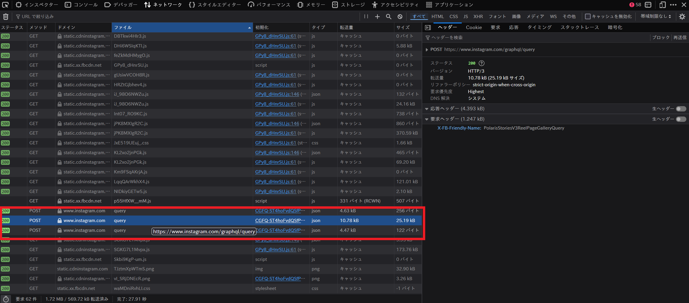
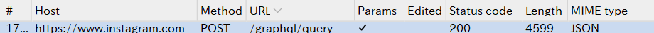
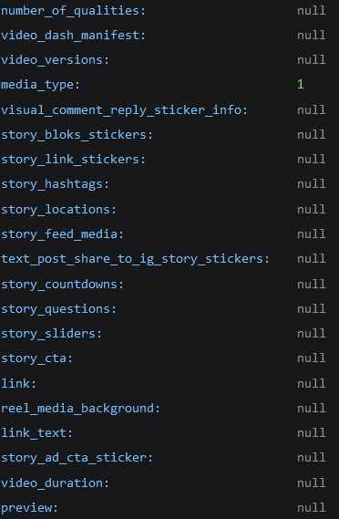
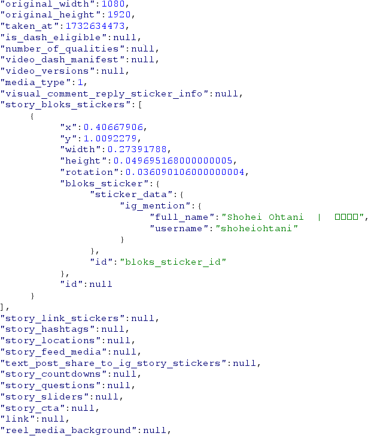
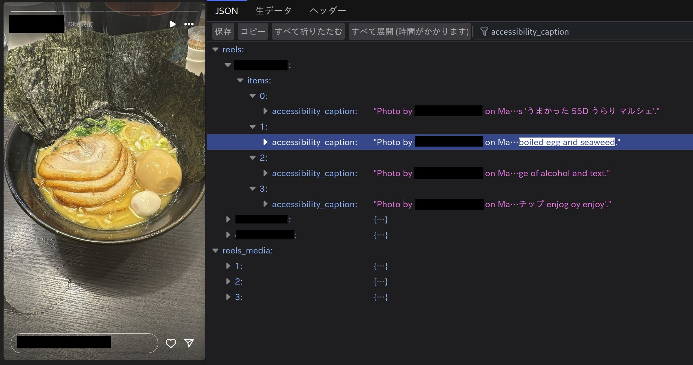
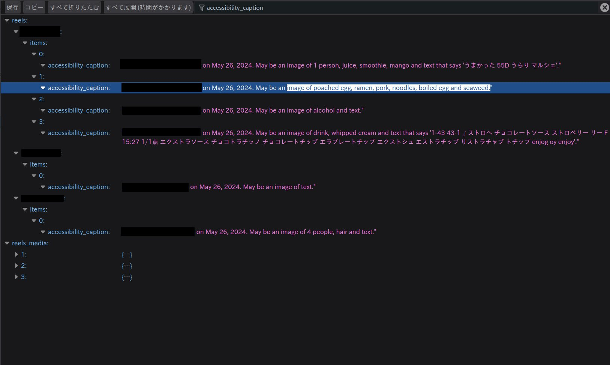

Burp Suiteを使ってInstagramの通信を観測していたところ、たまたま面白いものが見つかったので共有します。

## 手順

### 1.ストーリーを取得する
Burp SuiteのProxyを起動してからクライアントからストーリーを表示します。  
ストーリーを表示する前に`HTTP history`をclearしてから押すと後で探しやすくなります。  
他にBurpを使わなくてもブラウザの開発者ツールのネットワークという項目からも同じことができます。

### 2.GraphQLからデータを取得する
`HTTP history`で得た情報からこのような`/graphql/query`に注目します。

`MEME type`がJSONであるのが特徴です。  

Response Headerには`X-FB-Friendly-Name`という項目があります。これを見ることでjsonの中身が何なのか何となく分かります。

| X-FB-Friendly-Name                             | 機能内容(予測)                                    | 
| ---------------------------------------------- | ------------------------------------------------ | 
| PolarisStoriesV3ReelPageGalleryQuery           | ストーリーのタイムライン                           | 
| PolarisStoriesV3SeenMutation                   | 不明                                             | 
| PolarisStoriesV3ReelPageGalleryPaginationQuery | 特定のユーザのストーリー情報                       | 
| PolarisStoriesV3AdsPoolQuery                   | 広告関連                                         | 
| PolarisAPICheckNewFeedPostsExistQuery          | 名前からして、新しい投稿をチェックする動的処理？     | 
| PolarisStoriesV3HighlightsPageQuery            | 特定のユーザのハイライト情報                       | 

メタ情報には12種類の画像サイズや、ストーリーに付けたステッカー情報を見ることができます。

## 余談
以前までは`accessibility_caption`という項目で画像に写っている物や文字を自動的に説明する文章が生成されていました。これらは内部で垢BAN対策に用いられているのかなと考察していましたが、今回調べたらNULLに変わっていたのでなくなったのかもしれません。

