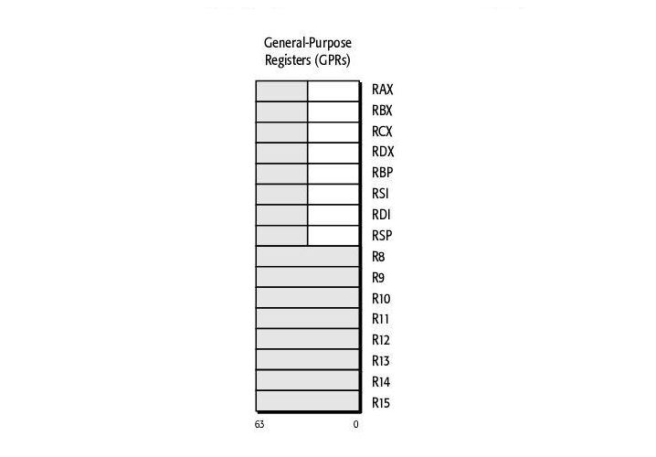
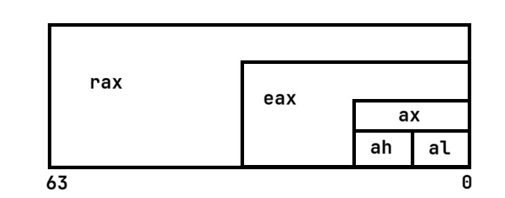

# データ型
| データ型 | ビット数(バイト数) | 接頭辞 | 
| -------- | ------------------ | ------ | 
| Byte     | 8bit (1bytes)      | b      | 
| Word     | 16bit (2bytes)     | w      | 
| Dword    | 32bit (8bytes)     | l      | 
| Qword    | 64bit (16bytes)    | q      | 

### 1Byteの半分  
ニブル（nybble）は4Bitを表している。つまり16進数で`5D`であれば**2ニブル**と呼ぶ  

# 汎用レジスタ
x64にレジスタは16個ある。一つのレジスタのビット数は64Bitである。



```
{rax, rbx, rcx, rdx, rbp, rsi, rdi, rsp, r8, r9, r10, r11, r12, r13, r14, r15}
```

## レジスタにアクセス
例えば`rax`レジスタの下位32Bitを参照するには`eax`レジスタにアクセスする。
また下位16Bitを参照する場合は`ax`レジスタを参照する。
`ax`レジスタの上位8bitにアクセスする場合は`ah`レジスタを参照し、下位8bitにアクセスする場合は`al`レジスタを参照する。   

`rax`レジスタは全体でこのような構造をしている。

:::important[重要]
`eax`,`ax`,`ah`,`al`はそれぞれ独立したレジスタではなく、`rax`レジスタの一部にアクセスするための**Alias**である
:::

### 全てのレジスタのAliasはこのようになる。[^1]

| 64ビットレジスタ | 下位３２ビット | 下位１６ビット | 下位8ビット | 
| ---------------- | -------------- | -------------- | ----------- | 
| rax              | eax            | ax             | al          | 
| rbx              | ebx            | bx             | bl          | 
| rcx              | ecx            | cx             | cl          | 
| rdx              | edx            | dx             | dl          | 
| rsi              | esi            | si             | sil         | 
| rdi              | edi            | di             | dil         | 
| **rbp**              | **ebp**            | bp             | bpl         | 
| **rsp**              | **esp**            | sp             | spl         | 
| r8               | r8d            | r8w            | r8b         | 
| r9               | r9d            | r9w            | r9b         | 
| r10              | r10d           | r10w           | r10b        | 
| r11              | r11d           | r11w           | r11b        | 
| r12              | r12d           | r12w           | r12b        | 
| r13              | r13d           | r13w           | r13b        | 
| r14              | r14d           | r14w           | r14b        | 
| r15              | r15d           | r15w           | r15b        | 
|                  |                |                |             | 

## レジスタの役割
`rsp`レジスタは**スタックポインタレジスタ**として使用される。  
`rbp`レジスタは**ベースポインタレジスタ**として利用される。  
それ以外のレジスタの用途は汎用として利用され、演算の際に一時的な格納場所として使用されたりする。  

# 呼び出し規約
## Windowsでの呼び出し規約[^2]

関数から呼び出された引数は`rcx`,`rdx`,`r8`,`r9`の順に格納される。第四引数以降はスタックに格納される。


| 引数     | **整数型・ポインター**  | 浮動小数点 | 
| -------- | --------------------- | ---------- | 
| 第一引数 | **rcx**                   | xmm0       | 
| 第二引数 | **rdx**                   | xmm1       | 
| 第三引数 | **r8**                    | xmm2       | 
| 第四引数 | **r9**                    | xmm3       | 

## Linuxでの呼び出し規約[^3]

関数から呼び出された引数は`rdi`, `rsi`, `rdx`, `rcx`, `r8`, `r9`の順に格納される。第七引数以降はスタックに格納される。

| 引数     | **整数型・ポインター**  | 浮動小数点 | 
| -------- | --------------------- | ---------- | 
| 第一引数 | **rdi**                   | xmm0       | 
| 第二引数 | **rsi**                   | xmm1       | 
| 第三引数 | **rdx**                   | xmm2       | 
| 第四引数 | **rcx**                   | xmm3       | 
| 第五引数 | **r8**                    | xmm3       | 
| 第六引数 | **r9**                    | xmm3       | 


# ptr演算子
アセンブリではメモリサイズを自分で明記しなくてはい。
```asm
mov [rcx], 5dh ;5dは10進数で93
```

そのため、このような記述ではrcxレジスタのどのデータサイズで`5`を格納するのかが分からないためエラーとなる。  

```asm
mov eax, 5dh
mov [rcx], eax 
```
このような記述をする必要がある。
```asm
mov dword ptr[rcx], 5dh
```
ptr演算子を使うことでメモリサイズを指定することが出来る。  

| ptr演算子   | サイズ(bit) | 
| ----------- | ----------- | 
| byte ptr    | 1           | 
| word ptr    | 2           | 
| dword ptr   | 4           | 
| qword ptr   | 8           | 
| xmmword ptr | 16          | 
| ymmword ptr | 32          | 
| zmmword ptr | 64          | 

# データ移動命令
データがある場所から別の場所へ移動させる。  
高級言語でいう代入に当てはまる。  
```asm
mov dst, src
```

## レジスタへ定数を格納する
```asm
mov eax , 10
mov eax , 64h  ;16真数の値0x64をeaxレジストリに格納している。  
```

## レジストリからレジストリへの値移動
```asm
mov ebx, 10
mov eax, ebx
```
これは、ebxに定数10を格納した後に、ebxの中身をexaへ格納している。  
つまり、eax = ebx , 10 = eaxとなる。

## メモリからレジストリへの値移動
例えば、C言語でint a = 64;を行ったとする。  
そして、変数aはメモリ0x403000に格納されたと仮定する。  

この場合、メモリからレジストリへの値移動をさせると  
```asm
mov eax, [0x403000]
```
となる。[0x403000]はint(4バイト)でメモリに格納されているので、movを使った時もexaには4バイト移動する。  
アセンブリコードで4バイトを指定することはない。  

重要なのは括弧で囲まれた全てがアドレスになること。  
```asm
mov eax, [0x403000]
mov ebx, [eax]
```
これは、eaxに入れた0x403000のアドレスが、後のmov ebx, [eax]で、ebxにも同じアドレスが格納されている。

```asm
mov ebx,[0x403000]
mov ecx,[0x705000]
mov eax,[ebx+ecx]
```
これは3行目で二つのレジスタを加算しているので、eaxのアドレス値は0xB08000となる。  

```asm
mov ebx,[ebp-4]
```
例えば、ebp値に0x403000があるとする。するとebp-4は元のebpのアドレス値から0x4加減したアドレスを指す。  
また、ebpはべースポインタレジスタなので、[ebp-4]のアドレスにあるデータをebxに格納する。

# 分岐と条件

## 無条件ジャンプ
常にジャンプをする。JMP命令はC言語のGOTO文に似ている  
```asm
JMP <jump address>
```
## 条件ジャンプ
x86では第一引数から、第二引数を引き算し、結果をフラグを設定する。  
```asm
mov eax, 5
cmp eax, 5
```
eaxから5を引き算し、結果は0になるため、ゼロフラグを設定するが、結果は格納されない。  

# 関数の呼出し
```asm
call <some_funciton>
```
<some_funciton>にはアドレスが含まれる。  

## 関数の終了
関数から呼出し元に戻るときは`RET命令`を使います。  

# スタック
スタックは「後入れ後出し」構造を採用している。つまり、スタックに入れた最新のデータが、スタックから取り出される最初のデータになる。  
PUSH命令でデータをスタックに格納。32Bitの場合、4バイトずつデータを格納する。
POP命令でデータをスタックから取り出す。32Bitの場合、4バイトずつデータを取り出す。 
スタックは、上位アドレスから下位アドレス方向へ積み上げていく。  
スタックが作られると、一番先頭の上位アドレスを指す。  

# ESPレジスタ
ESPレジスタは関数の呼出しと戻りを管理する役割を果たす。

```asm
push 3
push 4
pop ebx
pop edx
```

例えば、ESPレジスタがスタックの最上部(0xff8c)を指してるとします。  
`push 3`を実行すると、ESPは4減少して、3という値がスタックに格納されます。そしてESPは0xff88を指します。  
次に`push 4`を実行すると、ESPは4減少して、4という値がスタックに格納されます。そしてESPは0xff84を指します。
そして、`pop EBX`を実行すると、現在スタックの先頭(0xff84)に格納されているデータをEBXレジスタに格納されて、ESPは4増加します(現在のESPは0xff88)。  
同様に、`pop EDX`を実行すると、ESPは4増加して、格納されていたデータはEDXに格納されます。そしてスタックの先頭は0xff8cを指します。  

# 関数パラメータと戻り値
main関数のアセンブリ言語を見てみます。
```c
int main()
{
    test(2,3)
    return 0;
}
```

```asm
push 3
push 2
call test
add esp, 8
xor eax, eax
```
1~3行目は関数呼出しを意味しています。引数は右から左にスタックへPUSHします。  
4行目はtest関数が終了した後の処理になります。関数が実行された後に元のアドレスに戻るために、
espにpushした数*4Byte分だけ加算します。(今回の場合、test関数は引数が2つ必要なので2*4Byte=8となります。)  
このような処理をリターンアドレスと言います。  

```c
int test(int a, int b)
{
   int x, y;
   x = a;
   y = b;
   return 0;
}
```
次にtest関数の中身です。  
```asm
push ebp
mov ebp, esp
sub esp, 8
mov eax , [ebp+8]
mov eax, [ebp+8]
mov [ebp-4], eax
mov ecx, [ebp+0Ch]
mov [ebp-8], ecx
xor eax, eax
mov esp, ebp
pop ebp
ret
```
1行目は**フレームポインター**と呼ばれる関数の実行に関連する情報を管理するポインターです。
これは関数が終了したときに復元を行うための操作です。ebpに戻り先(呼出し元)のアドレスをebpに格納します。
PUSHしているので、EBPレジスタが4減少します。  
͏  
2行目ではespの値をebpにコピーしています。これは呼び出し元のアドレスをespに格納しています。
これで関数内の宣言なのをebp内で自由に行えます。  
͏  
3行目でローカル変数を入れるための空間を用意します。  
͏  
4~9行目で関数内での処理を行っています。  
͏  
10行目は2行目と逆の操作をしています。これで、呼出し元の関数に戻ります。  
11行目は1行目と逆の操作をしています。  
͏  
[x86アセンブリ言語での関数コール](https://web.archive.org/web/20220813235400/https://vanya.jp.net/os/x86calemistry  /)  

͏  
main関数に話を戻します。test関数が終了した後、main関数では`add esp, 8`から始まります。  
これは、espレジスタのスタックを綺麗にするために行われます。
この綺麗にする操作を呼出し先が行うのか呼出し元が行うのかは、コンパイラによって違います。
がしかし、C言語のプログラムのほとんどは呼び出し元が行うことになっています。

# 配列と文字列の逆アセンブル  
```c
int nums[3] = {1,2,3}
```
配列はアドレスに`配列の先頭アドレス + 変数のサイズ × 要素番号`で決まります。  

 <!--
#  さらなる学習のため
[Learn C](www.programiz.com/c-programming)  
[C Programming Abslute Beginner's](www.tutorialspoint.com/assembly_programming)    
[Assembly Language](pacman128.github.io/pcasm/)  
[x86 Disassembly](en.wikibooks.org/wiki/x86_disassembly)  
 -->

[^1]: [x64 アーキテクチャ #レジスタ](https://learn.microsoft.com/ja-jp/windows-hardware/drivers/debugger/x64-architecture#registers)

[^2]: [x64 アーキテクチャ #呼び出し規則](https://learn.microsoft.com/ja-jp/windows-hardware/drivers/debugger/x64-architecture#calling-conventions)

[^3]: [Linux x64 Calling Convention: Stack Frame](https://www.ired.team/miscellaneous-reversing-forensics/windows-kernel-internals/linux-x64-calling-convention-stack-frame)
