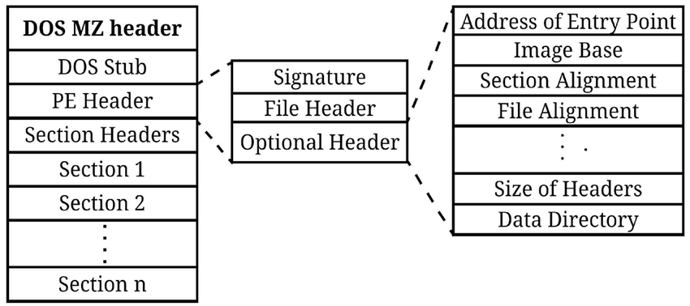

**AddressOfEntryPoint** 実行開始アドレスを格納  

## PEフォーマット
[PE Format.pdf](https://www.openrce.org/reference_library/files/reference/PE%20Format.pdf)    

## vmprotectや仮想化を用いた難読仮について
[仮想マシンベースの難読化: 概要](https://www.hackcyom.com/2024/09/vm-obfuscation-overview/)   
[VMProtectの動作原理分析と自動難読化解除実装](https://koreascience.kr/article/JAKO202025356104834.page)  

## 基本的なPacking技術
[PicoCTF 2022「unpackme」の復習](https://shinobe179.hatenablog.com/entry/2022/05/28/125558)  
[【CyberDefenders】UnPackMe Lab【Walkthrough】](https://qiita.com/schectman-hell/items/45f1cae15af643ca74d2)  
[サイバーセキュリティモニタリング（マルウェア解析編）](https://asuwa.hatenablog.com/entry/20170901/1504299318)  

## CTFサイト
[unpac.me](https://www.unpac.me/)  
[cyberdefenders](https://cyberdefenders.org/blue-team-labs/)  
