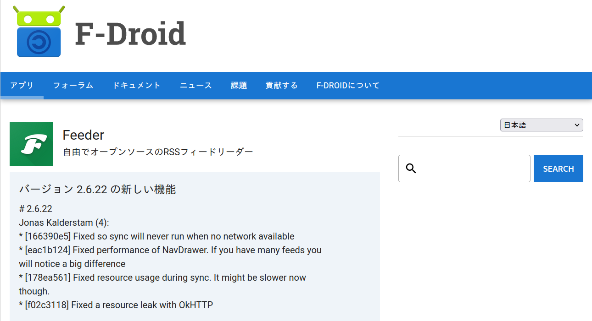
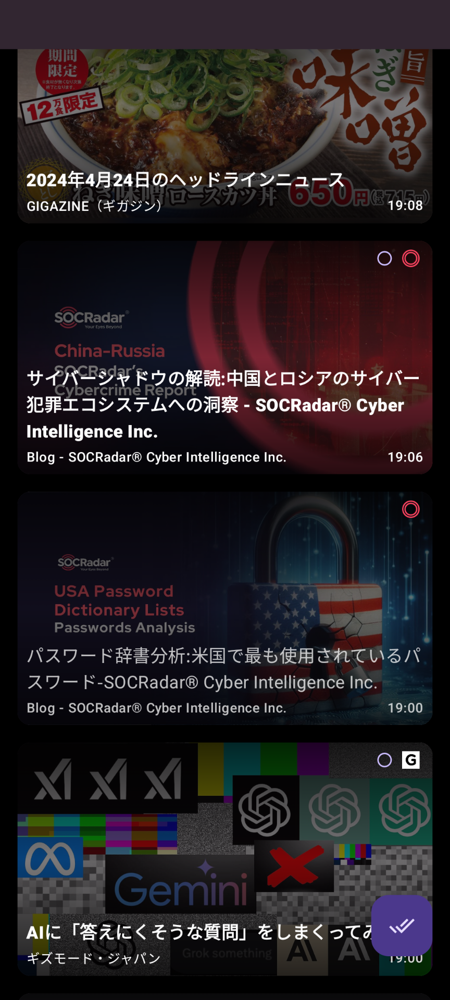
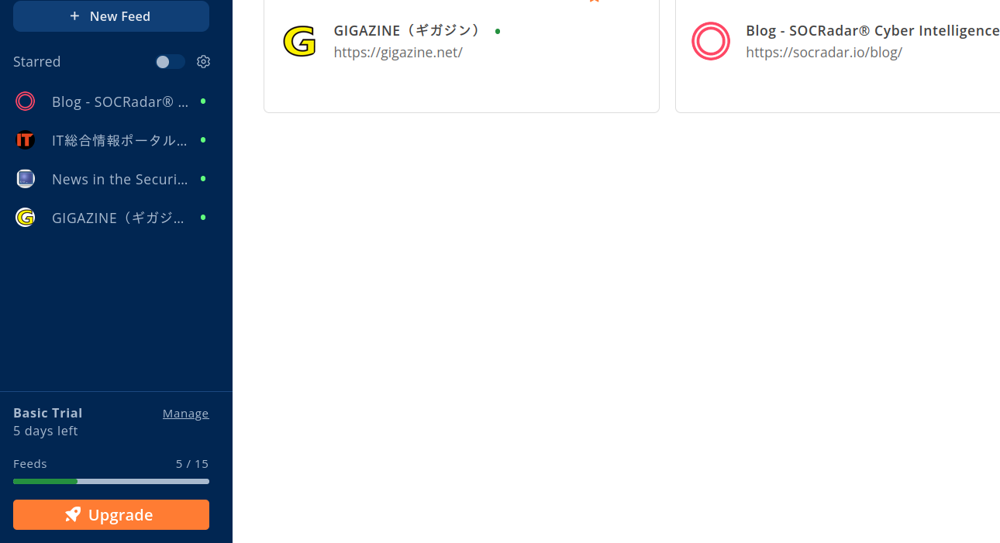
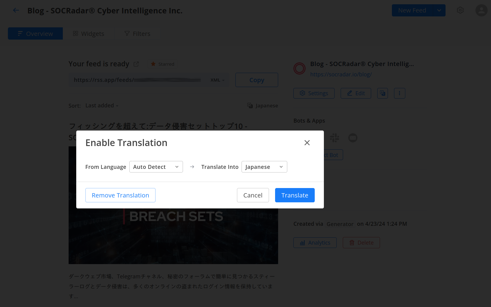

みなさんはIT系のニュースをどうやって収集してますか？
最近RSS.AppとFeederの組み合わせが便利だったので紹介します。

## RSSって？
総務省の説明をお借りすると  
> RSS（アール・エス・エス：Rich Site Summary）とは、ウェブサイトの要約や記事の見出しなどを配信するためのXMLベースのデータフォーマットです。RSSリーダーと呼ばれるソフトウェアやRSSに対応したブラウザを使用することで、総務省に掲載された新着情報を素早く入手して、興味のある記事を簡単に閲覧することができます。— <cite>RSS配信について[^1]</cite>  

まぁサイトの管理者がページを更新するたびにXMLファイルでできたサイトの情報を配信してくれるのでそれを追っかけることで最新の情報が手に入ります。

## Feeder
オープンソースで開発されているRSSフィードリーダーです。現在はAndroidのみで利用が可能です。
[Google Play](https://play.google.com/store/apps/details?id=com.nononsenseapps.feeder.play) 
[F-Droid](https://f-droid.org/ja/packages/com.nononsenseapps.feeder/)

使用感はこんな感じです。

どうですか？Gigazinやギズボード、海外記事であるSOCRadarも見出しが日本語に翻訳されて表示されています。

## RSS.App
RSSはサイトの管理者が設定するものなので、たまにRSSを設定してないブログもあります。また、RSSが提供されていても上手く画像が読み込まれていなかったりします。  
そこで[RSS.App](https://rss.app/ja)です。RSS.Appは特定のサイトをxml化してくれます。  

無料版は15個までサイトを追加できます。

海外ブログもここを経由して翻訳してもらっています。

これで通学中のTwitterの時間を減らしたいです☆

[^1]:[総務省 - RSS配信について](https://www.soumu.go.jp/menu_kyotsuu/rss_information.html)
